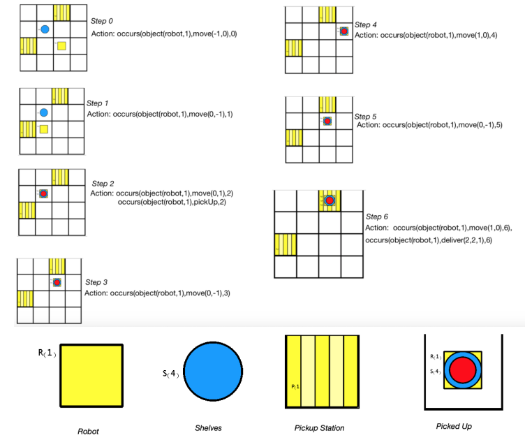

# 🧠 ASP Warehouse Challenge Solver – Knowledge Representation & Reasoning

Solves the **ASP Challenge Problem: Automated Warehouse Scenario** using Answer Set Programming (ASP) with Clingo. This project simulates robots that move shelves and deliver products to picking stations, while avoiding collisions and minimizing makespan.

---

## 📖 Overview

The following is the implementation for the **Automated Warehouse Scenario**, details about which can be found in the [ASP Challenge 2019](https://sites.google.com/view/aspcomp2019/problem-domains).

It models a constrained warehouse environment where multiple robots must deliver product shelves to picking stations using logic rules and declarative programming.

All warehouse behavior is encoded in logic rules, using `init(...)` atoms for setup and `occurs(...)` atoms for action planning.

---

## ✨ Key Features

- Fully solves the ASP Warehouse Challenge Problem using Clingo
- Declarative logic model of:
  - Robots, grid cells, highways, picking stations, shelves, products, orders
  - Actions: `move`, `pickup`, `putdown`, `deliver`
- Constraints ensure:
  - No collisions
  - Valid product delivery
  - Proper pickup/putdown sequencing
  - No illegal shelf placement on highways
- Plan scoring based on makespan optimization
- Based on the formal structure and scoring schema from ASP Challenge documentation

---

## 🖼️ Screenshots

**Warehouse Planning Output**

_Shows the robots' coordinated actions across time steps on a 4×4 warehouse grid._

---

## 🧰 Technologies Used

- **Answer Set Programming (ASP)** – declarative logic programming  
- **Clingo** – ASP solver from Potassco  
- **Stable model semantics** – supports non-monotonic reasoning  
- **LaTeX / PDF** – project report generation and documentation

---

## ⚙️ How to Build and Run

### 1. Install Clingo  
Download Clingo from: [https://potassco.org/clingo/](https://potassco.org/clingo/)

### 2. Run the solver

    clingo robot.lp -c maxsteps=30

### 3. Analyze output  
Look for `occurs(...)` atoms to understand the robot plan over time steps.

---

## ⚠️ Important Notes

- This project directly implements the official **ASP Challenge Problem** specs from Potsdam University.
- All `init(...)` facts must match a valid grid layout.
- No duplicate placements, collisions, or switching allowed.
- Highways must remain shelf-free.
- Delivery steps reduce product quantities and complete orders logically.

---

## 📝 License

This repository is provided for **academic and portfolio purposes only**.  
Do not use this work for academic submission without proper citation or permission.

---
